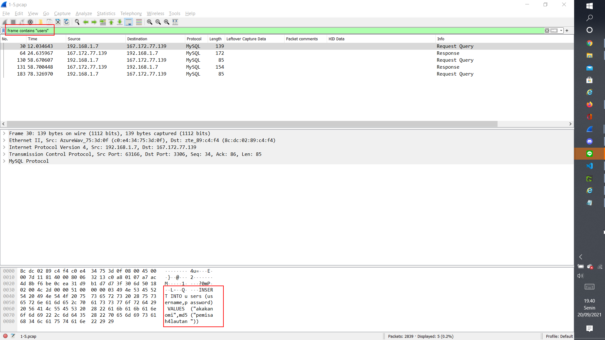

# Jarkom-Modul-1-T7-2021
### Laporan Resmi Pengerjaan Sesi Lab Jaringan Komputer

#### Nama Anggota Kelompok :
1. Naufal Aprilian (05311940000007)
2. Bryan Yehuda Mannuel (05311940000021)
3. Mulki Kusumah

## 1. Sebutkan Webserver yang digunakan pada "ichimarumaru.tech"!

Masukkan Command Filter : http.host contains "ichimarumaru.tech"

Kemudian lakukan : Follow TCP stream

Jawabannya : nginx/1.18.0 (Ubuntu)

## 2. Temukan Paket dari web-web yang menggunakan Basic Authentication method!

Masukkan Command : http.authbasic

Telah ditemukan Host : basic.ichimarumaru.tech
Terlihat paket dari web-web yang menggunakan basic authentication method

## 3. Ikuti perintah di basic.ichimarumaru.tech! Username dan Password bisa didapatkan dari file .pcapng!

Masukkan Command : http.host contains "basic.ichimarumaru.tech"

Kemudian didapatkan Basic Authentication berupa base 64 pada header:
a3VuY2ltZW51anVsYXV0YW46dFFLRUpGYmdOR0MxTkNabFdBT2poeUNPbTZvM3hFYlBrSmhUY2laTg==

Dengan hasil Decode:

kuncimenujulautan:tQKEJFbgNGC1NCZlWAOjhyCOm6o3xEbPkJhTciZN

username: kuncimenujulautan

password: tQKEJFbgNGC1NCZlWAOjhyCOm6o3xEbPkJhTciZN

Kunjungi Website basic.ichimarumaru.tech 
dan isikan jawaban urutan konfigurasi pengkabelan T568A

## 4. Temukan Paket MySQL yang mengandung perintah Query Select!
REVISI

Masukkan command pada filter : frame matches "select"

Terdapat 3 paket yang bisa terlihat pada Wireshark

## 5. Login ke portal.ichimarumaru.tech kemudian ikuti perintahnya! Username dan Password bisa didapat dari Query Insert pada Table Users dari file .pcap!

Masukkan command : frame contains "users"

Kemudian lakukan : Follow TCP stream

Didapatkan ("akakanomi",md5("pemisah4lautan")) dengan username "akakanomi" dan password "pemisah4lautan" untuk dilakukan login pada portal.ichimarumaru.tech
Kemudian isikan jawaban urutan konfigurasi Pengkabelan T568B

## 6. Cari Username dan Password ketika melakukan Login ke FTP Server!
Masukkan command Filter : ftp.request.command==USER || ftp.request.command==PASS

Kemudian ditemukan:

USER: secretuser

PASS: aku.pengen.pw.aja

## 7. Ada 500 file Zip yang disimpan ke FTP Server dengan nama 0.zip, 1.zip, 2.zip, ..., 499.zip. Simpan dan Buka file pdf tersebut.
Masukkan command : frame contains "Real.pdf"

Kemudian lakukan : follow tcp streams

Kemudian save as raw

Setelah file Real.pdf dibuka akan terlihat gambar tersebut

## 8. Cari paket yang menunjukan pengambilan File dari FTP tersebut!
Masukkan command Filter: frame contains "RETR"

## 9. Dari paket-paket yang menuju FTP terdapat indikasi penyimpanan beberapa file. Salah satunya adalah sebuah file berisi data rahasia dengan nama "secret.zip". Simpan dan Buka file tersebut!
Masukkan command : frame contains "secret.zip"

Kemudian lakukan follow TCP Stream dan akan didapatkan file zip dengan file signature PK

Kemudian lakukan save as raw

Buka File secret.zip, ternyata diminta password yang harus didapatkan dari file lain

## 10. Selain itu terdapat "history.txt" yang kemungkinan berisi history Bash Server tersebut! Gunakan isi dari "history.txt" untuk menemukan Password untuk membuka file rahasia yang ada di "secret.zip"!
Masukkan command filter : frame contains "STOR" && frame contains "history.txt"

Lakukan Follow tcp stream dan save as raw. Saat membuka file history.txt, ternyata kita membutuhkan file bukanapaapa.txt

Masukkan command : frame contains "STOR" && frame contains "bukanapaapa.txt"

untuk mendapatkan file bukanapapa.txt

Lakukan Follow tcp streams maka akan didapatkan file bukanapapa.txt
dan didapatkan password : d1b1langbukanapaapajugagapercaya

Masukkan password ke secret.zip

Buka file wanted.pdf dengan password yang sudah didapatkan

## 11. Filter sehingga Wireshark hanya mengambil paket yang berasal dari Port 80!

1. Mengisi Capture Filter dengan : `src port 80`

2. Berikut adalah hasil ketika Wireshark hanya mengambil paket yang berasal dari Port 80

## 12. Filter sehingga Wireshark hanya mengambil paket yang mengandung Port 21!

1. Mengisi Capture Filter dengan : `port 21`

2. Berikut adalah hasil ketika Wireshark hanya mengambil paket yang mengandung Port 21. Karena port 21 adalah port untuk FTP dan kami tidak memiliki server FTP, jadi kelompok kami melakukan testing koneksi ke alamat random dengan Username dan Password random. Alhasil koneksi bisa terlihat pada Wireshark namun ditolak karena Username dan Passwordnya salah.

## 13. Filter sehingga Wireshark hanya menampilkan paket yang menuju Port 443!

1. Mengisi Capture Filter dengan : `dst port 443`

2. Berikut adalah hasil ketika Wireshark hanya menampilkan paket yang menuju Port 443

## 14. Filter sehingga Wireshark hanya mengambil paket yang tujuannya ke kemenag.go.id!

1. Mengisi Capture Filter dengan : `dst host kemenag.go.id`

2. Berikut adalah hasil ketika Wireshark hanya mengambil paket yang tujuannya ke kemenag.go.id, untuk bisa menampilkan hasil ini kelompok kami harus mengunjungi situs Kemenag tersebut terlebih dahulu.

## 15. Filter sehingga Wireshark hanya mengambil paket yang berasal dari IP kalian!

1. Mencari IP di komputer kami menggunakan Command Prompt dan memasukkan : `ipconfig`
2. Didapatkan IP-nya adalah `10.27.161.52`
3. Mengisi Capture Filter dengan : `src host 10.27.161.52`

4. Berikut adalah hasil ketika Wireshark mengambil paket yang berasal dari IP kami.

## Kendala
Sebenarnya tidak ada kendala hanya saja tidak teliti dalam pengerjaan nomor 4 kami hanya mendapatkan 2 paket yang berisikan query select dengan filter `frame contains "select"`. Setelah itu kami melakukan revisi dengan filter `frame matches "select"` dan didapatkan 3 paket yang berisikan query select
